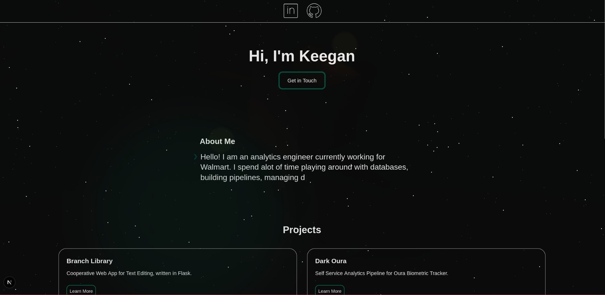

# Personal Website V2

## To Do
1. Correct tailwind custom animations not computing when sourced from `tailwind.config.js` file
2. ~Project2~
3. ~Project3~
4. ~Project4~
5. ~Email loop for Navbar~
6. Actions
7. Heroku
8. Domain
9. ~Fix Dark oura streamlit deployment to link~
10. Email Server

